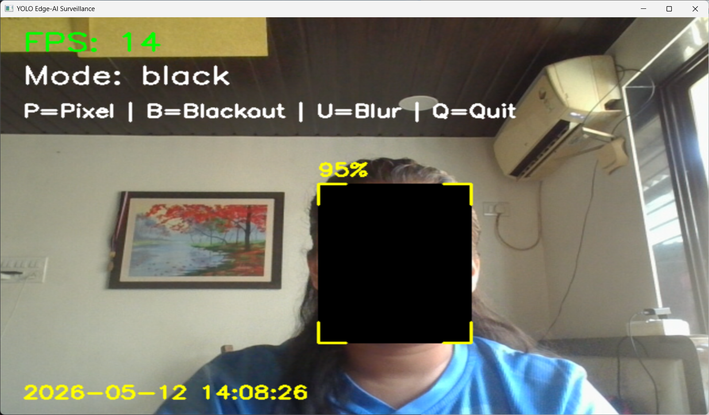
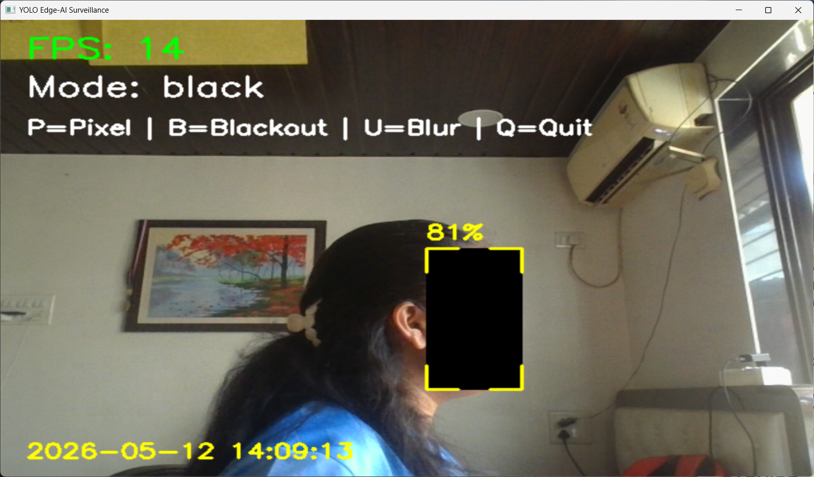
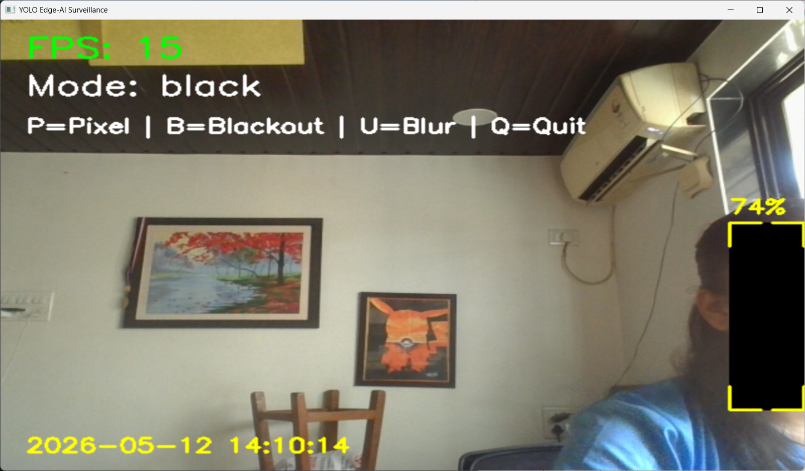
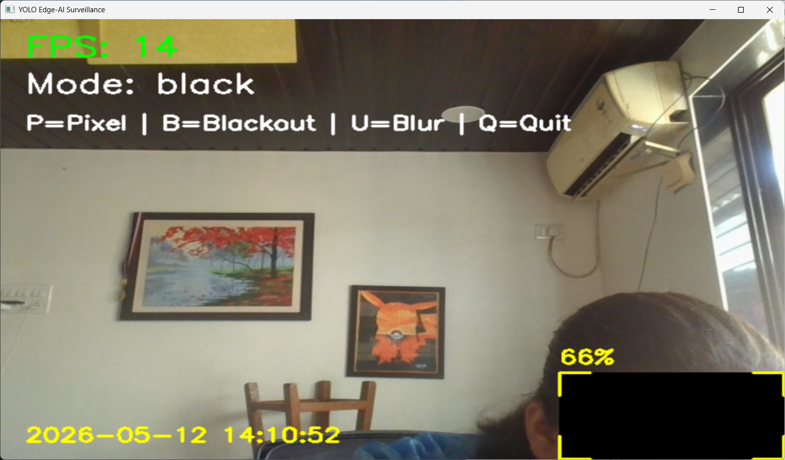
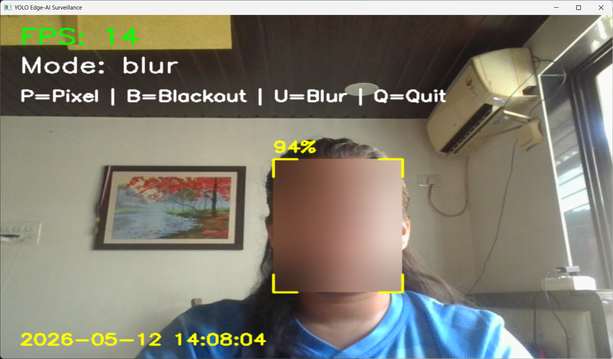
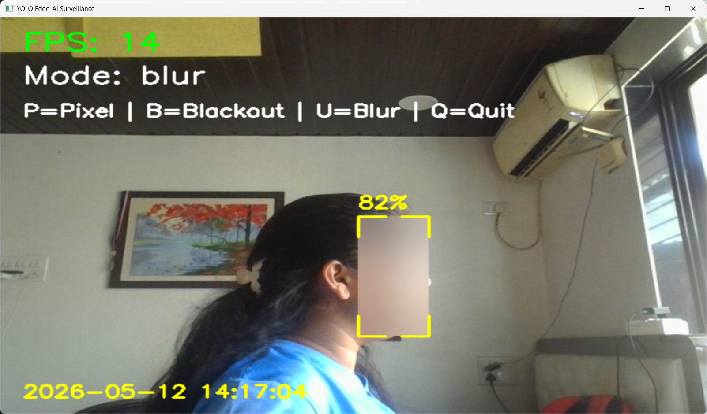
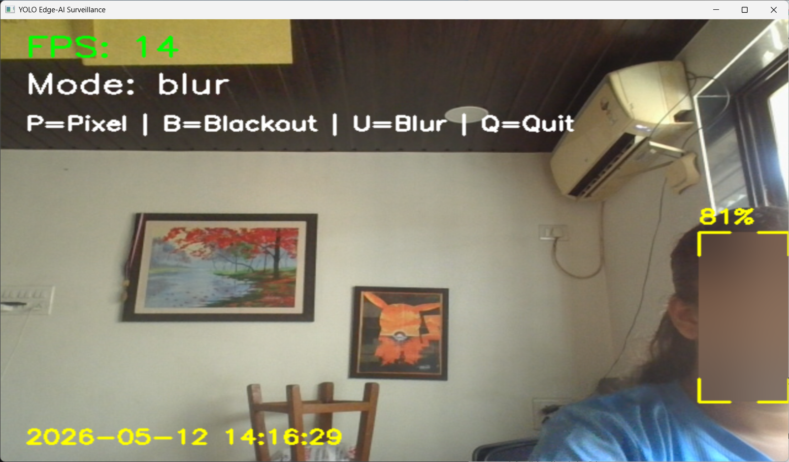
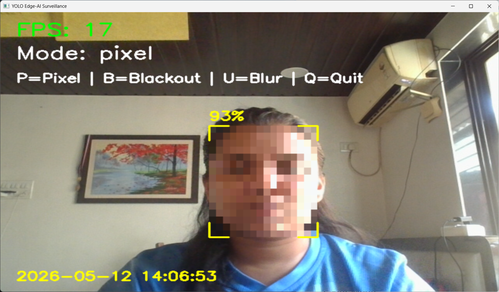
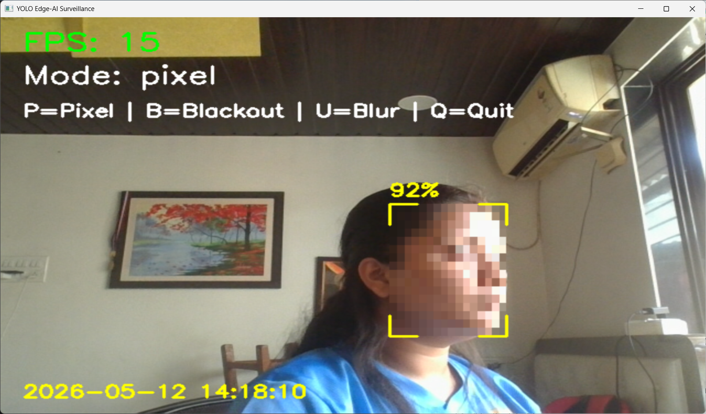
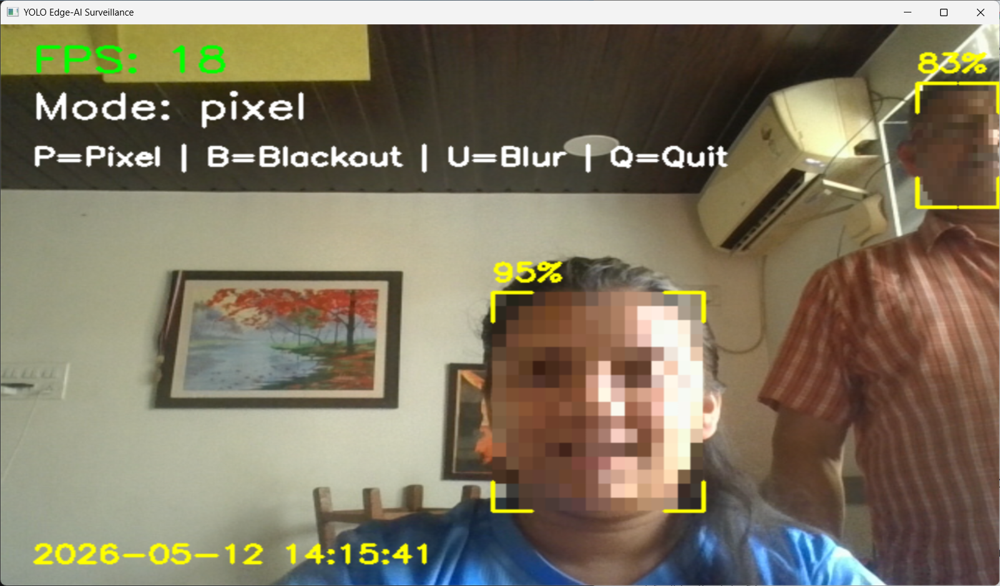

# YOLOv8 Edge-AI Privacy Masking System
Real-time privacy-preserving surveillance anonymization using YOLOv8 and Edge-AI inference.

The system performs live facial anonymization using adaptive masking techniques including:

- Pixelation
- Gaussian Blur
- Blackout Masking

Designed as an offline Edge-AI pipeline capable of running locally without requiring cloud inference.

---

## Features

- Real-time YOLOv8 face detection
- Side-face and angled-face support
- Pixelation mode
- Blur mode
- Blackout mode
- FPS monitoring
- Detection confidence display
- Timestamp overlay
- Futuristic HUD interface
- AI shield watermark
- Offline edge inference
- Real-time webcam processing

---

## Screenshots

### Blackout Mode






---

### Blur Mode





---

### Pixel Mode





---

## Demo Video

A demonstration video showcasing:
- real-time YOLOv8 face detection
- adaptive masking modes
- side-profile detection
- futuristic HUD interface

The demonstartion video is available in:
`output/edge_ai_demo.mp4`

---

## Controls

| Key | Action |
|-----|--------|
| P | Pixelation Mode |
| U | Blur Mode |
| B | Blackout Mode |
| Q | Quit Application |

---

## Technologies Used

- Python
- OpenCV
- YOLOv8
- Ultralytics
- NumPy

---

## System Architecture
```text 
Video Stream
      ↓
YOLOv8 Face Detection
      ↓
Bounding Box Extraction
      ↓
Privacy Filter Application
      ↓
HUD Rendering
      ↓
Real-Time Display
```

---

## Installation

### Clone Repository
```bash 
git clone <your-repo-link>
cd edge-ai-face-masking
```
### Install Dependencies
```bash
pip install -r requirements.txt
```

### Run Application
```bash
py -3.12 main.py
```

---

## Future Improvements

- Multi-face tracking
- Stable temporal masking
- GPU acceleration
- CCTV batch processing
- Threat detection overlays
- Multi-camera support

---

## Ethical Considerations

This project is intended solely for privacy-preserving AI research, educational computer vision experimentation, and surveillance anonymization studies.